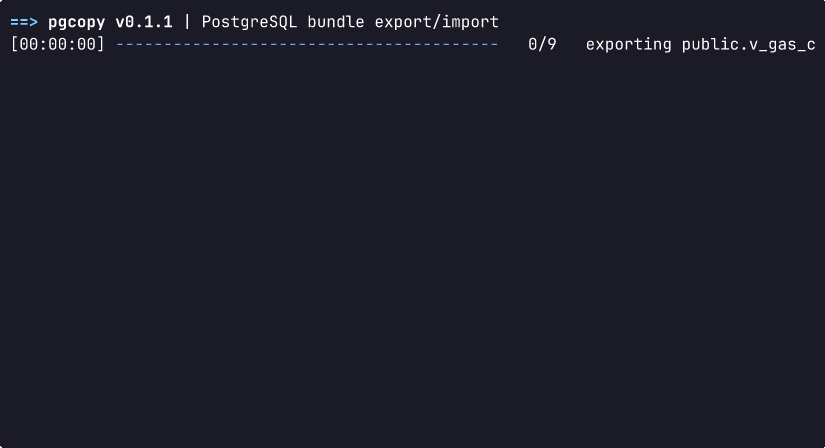

# pgcopy

[🇺🇸 English](./README.md) · [🇷🇺 Русский](./README.ru.md)

`pgcopy` is a command-line tool for moving selected PostgreSQL tables, views, and materialized views between databases. It exports their schema and data into a single compressed bundle, then imports the bundle into another database.

By default, source objects are materialized as regular tables at the destination. A view can also be preserved with `export_as = "view"`.

## Features

- Export multiple PostgreSQL objects into one `tar.zst` bundle.
- Import with `replace` or `append` semantics, or create schema only with `--ddl-only`.
- Select columns and rows with a compact SQL-like configuration.
- Process independent objects concurrently.
- Encrypt bundles with a passphrase.
- Inspect bundle metadata without connecting to PostgreSQL.

## Installation

### Prebuilt binaries

Download the archive for your platform from [GitHub Releases](https://github.com/hexqnt/pgcopy/releases/latest):

| Platform                         | Archive suffix                     |
| -------------------------------- | ---------------------------------- |
| Linux x86-64 (glibc)             | `x86_64-unknown-linux-gnu.tar.gz`  |
| Linux x86-64 (static musl build) | `x86_64-unknown-linux-musl.tar.gz` |
| Windows x86-64                   | `x86_64-pc-windows-msvc.zip`       |
| macOS Apple Silicon              | `aarch64-apple-darwin.tar.gz`      |

On Linux or macOS, extract the archive, rename the versioned executable, and place it on your `PATH`:

```bash
tar -xzf pgcopy-vX.Y.Z-<target>.tar.gz
mkdir -p ~/.local/bin
install -m 755 pgcopy-vX.Y.Z-<target> ~/.local/bin/pgcopy
pgcopy --help
```

Replace `vX.Y.Z` and `<target>` with the values from the downloaded filename. Make sure `~/.local/bin` is on your `PATH`.

On Windows, extract the ZIP archive and either run the executable directly or rename it to `pgcopy.exe` and move it into a directory on `PATH`:

```powershell
Expand-Archive -Path .\pgcopy-vX.Y.Z-x86_64-pc-windows-msvc.zip -DestinationPath .\pgcopy
Rename-Item .\pgcopy\pgcopy-vX.Y.Z-x86_64-pc-windows-msvc.exe pgcopy.exe
.\pgcopy\pgcopy.exe --help
```

### From source

Install the [Rust toolchain](https://rustup.rs/), then install `pgcopy` from a local clone:

```bash
git clone https://github.com/hexqnt/pgcopy.git
cd pgcopy
cargo install --locked --path .
pgcopy --help
```

Cargo installs the executable into `~/.cargo/bin` by default; this directory normally needs to be on your `PATH`.

## Quick start

Create `config.toml` describing what to export:

```toml
[general]
data_format = "binary"
concurrency = 4

[[objects]]
select = "select * from public.orders"

[[objects]]
select = "select id, total_amount from public.invoices where paid = true"
target_schema = "archive"
target_name = "paid_invoices"
```

Set the standard PostgreSQL connection variables for the source database and export the bundle:

```bash
export PGHOST=source.example.com
export PGPORT=5432
export PGDATABASE=app_db
export PGUSER=app_user
export PGPASSWORD=secret

pgcopy export --config ./config.toml --out ./bundle.tar.zst
```

Point the variables at the destination database and import it:

```bash
export PGHOST=destination.example.com
export PGDATABASE=app_copy

pgcopy import --in ./bundle.tar.zst --mode replace
```




## Commands

```text
pgcopy export --config <config.toml> --out <bundle> [options]
pgcopy import --in <bundle> [options]
pgcopy info --in <bundle> [options]
```

Run `pgcopy --help` or `pgcopy <command> --help` for the complete CLI reference.

### `export`

- `--config`: export configuration file.
- `--out`: destination bundle path.
- `--concurrency N`: number of objects exported concurrently. Resolution order: CLI, `general.concurrency`, `PGCOPY_CONCURRENCY`, then `1`.
- `--password`: bundle encryption passphrase; falls back to the `PASSWORD` environment variable.

### `import`

- `--in`: bundle created by `pgcopy export`.
- `--mode replace|append`: replace an existing target object (the default), or append to a compatible table.
- `--concurrency N`: number of objects imported concurrently; defaults to `1`.
- `--ddl-only`: create target objects without loading rows.
- `--password`: bundle decryption passphrase; falls back to `PASSWORD`.

### `info`

Reads a bundle without connecting to PostgreSQL:

```bash
pgcopy info --in ./bundle.tar.zst
pgcopy info --in ./bundle.tar.zst --objects
pgcopy info --in ./bundle.tar.zst --format json
```

Global options include `--dry-run`, `--quiet`, and `--no-progress`.

## PostgreSQL connection

The `export` and `import` commands accept these connection options:

- `--host`
- `--port`
- `--dbname`
- `--username` (alias: `--user`)
- `--pgpassword`

The standard `PGHOST`, `PGPORT`, `PGDATABASE`, `PGUSER`, and `PGPASSWORD` environment variables are also supported. CLI values take precedence over configuration-file values, which take precedence over environment variables and defaults. When no explicit password is provided, `pgcopy` also checks the standard `.pgpass` file.

For `export`, connection settings may be stored in `config.toml`. Values can reference environment variables as `{VARIABLE}`:

```toml
[connection]
host = "{MY_PGHOST}"
port = 5432
dbname = "analytics"
user = "reader"
password = "{MY_PGPASSWORD}"
```

Keeping passwords in environment variables or `.pgpass` is preferable to putting them on the command line or in the configuration file.

## Configuration

The export configuration contains optional general settings and one or more objects:

```toml
[general]
data_format = "binary"
compression = "zstd"
consistent_snapshot = true
concurrency = 4

[[objects]]
select = "select * from public.orders"

[[objects]]
select = "select * except (internal_note) from public.customers"
target_schema = "snapshot"
target_name = "customers"

[[objects]]
select = "select * from reporting.sales_daily"
export_as = "view"
```

### General settings

- `data_format`: `binary` (default) or `csv`.
- `compression`: currently `zstd`.
- `consistent_snapshot`: use a single consistent database snapshot; defaults to `true`.
- `concurrency`: number of concurrent export workers; defaults to `1`.

### Objects

- `select` identifies the source object and optionally selects columns, filters, ordering, and a row limit.
- `target_schema` and `target_name` rename the imported object. Set either both or neither.
- `export_as` is `table` by default. Use `view` to preserve a source view and automatically export its dependencies as tables.

Supported `select` forms include:

```sql
select * from schema.object
select col1, col2 from schema.object
select * except (col1, col2) from schema.object
select ... from schema.object where ... order by ... limit 100
```

The selector operates on one `schema.object`; joins and grouping are not supported. Clauses must appear in `WHERE`, `ORDER BY`, `LIMIT` order. For `export_as = "view"`, use exactly `select * from schema.object`.

## Compatibility notes

- Binary bundles require the source and destination to use the same PostgreSQL major version. Use `data_format = "csv"` when moving between major versions.
- Import bundles containing preserved views with `--concurrency 1`, so their dependencies are created in order.
- `replace` is atomic per object: a failed object import is rolled back.

## Bundle encryption

Pass a bundle password directly or through the `PASSWORD` environment variable:

```bash
pgcopy export --config ./config.toml --out ./bundle.age --password 'strong-passphrase'
pgcopy import --in ./bundle.age --password 'strong-passphrase'
```

Without a password, bundles are written unencrypted. An encrypted bundle requires the same password for `import` and `info`.
